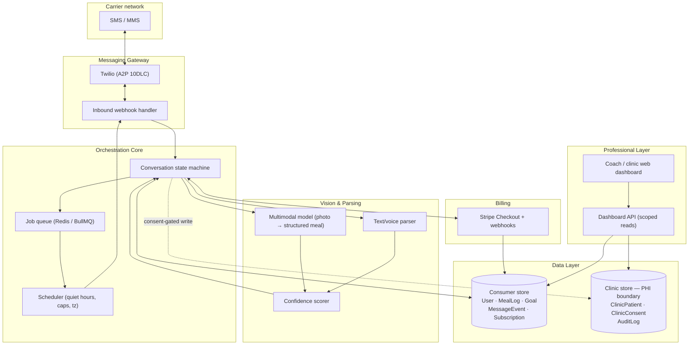
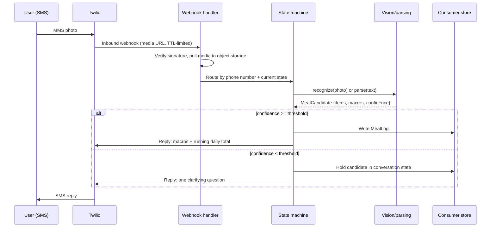
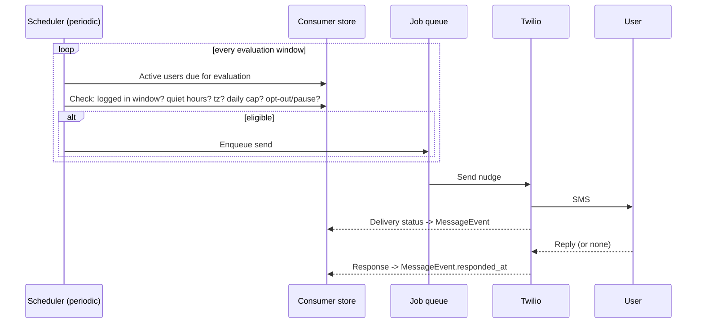
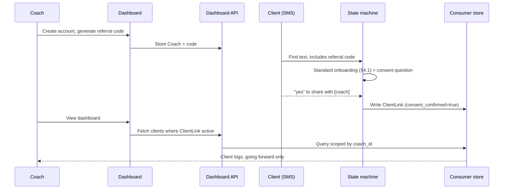
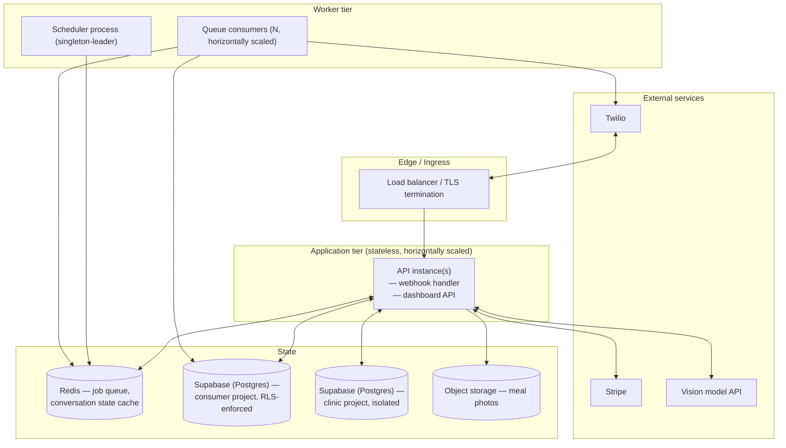

# Tally — System Architecture
### Technical Design Doc 03 — Architecture

> How the six components in Build Spec §2 actually fit together: data flow, service boundaries, the compliance split, and what breaks first under load. Written for whoever builds this next, alongside 04 — Technical Implementation.

**Prepared:** 24 Aug 2026 &nbsp;|&nbsp; **Companion docs:** 01 — Vision Brief · 02 — Build Spec · 04 — Technical Implementation &nbsp;|&nbsp; **Status:** Pre-build

## At a glance

| | |
|---|---|
| **6** | services behind the phone number: gateway, orchestrator, vision, data, billing, dashboard |
| **2** | physically separate data stores — consumer and clinic — from day one |
| **~10s** | round-trip budget for a photo-in, macros-out reply |
| **1** | queue that everything proactive (nudges, recaps, retries) flows through |

---

## 1. Architecture principles

Carried forward from the build spec, translated into system terms:

1. **The thread is the only interface.** There is no client app to hold state — every request is stateless at the transport layer, and all continuity lives in the orchestrator's conversation state, keyed by phone number.
2. **Fast path stays thin.** The photo-in → macros-out loop (§4.2 of the build spec) is the product. It gets a dedicated, minimal call path — no synchronous dependency on billing, scheduling, or the dashboard.
3. **Proactive is queued, never inline.** Nudges, recaps, and follow-ups are produced by a scheduler and consumed by the same send path as everything else — nothing proactive is allowed to bypass frequency caps or quiet-hours checks by being "special."
4. **The compliance boundary is physical, not logical.** Consumer and clinic data are separate stores from the first migration, not a `tier` column added under audit pressure later.
5. **Every write is attributable and reversible.** No hard deletes on meal logs (soft-delete + correction links), no silent overwrites — this is a system-level constraint, not just a UX promise in §4.3.

## 2. High-level component diagram

## 3. Component deep-dives

### 3.1 Messaging gateway

**Owns:** transport in/out, carrier compliance, media retrieval.

- Twilio is the sole transport for P0 (SMS/MMS over A2P 10DLC). The gateway is a thin adapter — one inbound webhook, one outbound send function — so a second channel (iMessage via Apple Messages for Business, P2) can be added as a second adapter behind the same orchestrator interface, not a rewrite.
- **STOP/START is handled at the carrier level** (build spec §4.7) and never touches application logic for the opt-out itself — Twilio suppresses delivery automatically. The application still listens for the Twilio status callback so `User.opt_out_at` stays accurate for reporting and so proactive sends stop being *attempted* (not just silently dropped by the carrier).
- MMS media (photos) arrives as a Twilio-hosted URL with a short TTL. The webhook handler's first job is to pull that media into permanent storage (object store, not the database) before the URL expires — this is the one hard latency constraint on the inbound path, ahead of even the vision call.
- Inbound webhook verifies the Twilio request signature (`X-Twilio-Signature`) before any processing. This is a hard trust boundary: everything downstream assumes the message is authentically from Twilio.

### 3.2 Vision & parsing pipeline

**Owns:** turning a photo or sentence into a structured, confidence-scored meal candidate.

- Two entry points converge on one output shape — `{ items[], calories, protein, carbs, fat, confidence, notes }` — so the orchestrator never branches on whether the source was a photo, text, or (P1) voice.
- The vision path calls a hosted multimodal model. This is treated as a **swappable, stateless dependency** behind an interface (`recognize(photo) -> MealCandidate`), not a hard vendor lock — the build spec is explicit that recognition itself is a commodity (Vision Brief §1); the architecture should not make switching providers expensive.
- Confidence scoring is a separate step from recognition, not a number the model self-reports. The scorer combines model-reported certainty with heuristics that matter more in practice: dish complexity (packaged vs. home-cooked, per build spec §4.2), portion ambiguity (no reference object in frame), and item-count. This keeps confidence tunable without re-prompting or retraining the vision model.
- Below-threshold results never reach the user as a clarifying *guess* — the orchestrator branches to a single clarifying question (§4.2 edge cases) and the candidate is held in conversation state, not written to `MealLog`, until resolved.

### 3.3 Orchestration core

**Owns:** per-user conversation state, and all proactive scheduling.

This is the architectural center of the product — everything else is a service the orchestrator calls.

- **State machine.** Every phone number has exactly one active conversation state (`onboarding:q2`, `awaiting_clarification:<meal_id>`, `idle`, `awaiting_checkout`, etc.). State is persisted, not in-memory, so a crashed process loses no context — the next inbound message reads state from the data layer and resumes. See §6.3 of the Technical Implementation doc for the full state table.
- **Scheduler.** A separate concern from the state machine: it doesn't react to inbound messages, it *decides when to originate one*. Runs as a periodic job (not per-user timers) that evaluates the full active-user set against quiet hours, per-user timezone, the daily frequency cap, and "already logged in this window" — then enqueues candidate sends onto the job queue. The queue, not the scheduler, is what actually calls the gateway — this decouples "decided to send" from "sent," so a gateway outage doesn't lose or duplicate the decision.
- Why a queue at all for a single-nudge-per-day product: it's the same mechanism that will carry retries (failed sends), the weekly recap (P1), and eventually a second channel — one proactive-send pipeline, multiple producers.

### 3.4 Data layer

**Owns:** system of record for both the consumer thread and the coach/clinic dashboard — same tables back both, per build spec §2.

- Single relational store for P0/P1 consumer + coach data (§3 of the build spec: User, MealLog, Goal, MessageEvent, Subscription, Coach, ClientLink), hosted on **Supabase** (managed Postgres). A relational model is the right fit here — the entities are highly relational (every MealLog belongs to a User, every ClientLink joins two other entities), and the dashboard's read patterns are exactly the kind of scoped, filtered queries relational indexing is built for.
- Supabase's **Row Level Security** is used as a database-enforced backstop to the consent scoping described in §3.6 and §5 — a coach's dashboard connection authenticates as that coach (via Supabase Auth) and the database itself, not just the API layer, refuses to return a client's rows without an active, consented `ClientLink`. This means a scoping bug in application code fails closed rather than leaking data. See Technical Implementation §3.3 for the policy definitions.
- Photos are **not** stored in the relational database — object storage (Supabase Storage, or any S3-compatible bucket), with the DB holding the URL/key. `MealLog.photo_url` is a pointer, not a blob.
- The **clinic-scoped store is a physically separate Supabase project** from the moment the first clinic contract exists (§6 of the build spec) — see §5 below. This is the one place the architecture pays complexity cost ahead of need, deliberately, because retrofitting a compliance boundary under an active BAA is the failure mode being designed against.

### 3.5 Billing

**Owns:** free-tier metering, checkout, subscription state.

- Stripe Checkout is used as a hosted flow — the product never renders payment UI, it sends a link in-thread (§4.6). This keeps PCI scope entirely off the application.
- Metering is a counter on `Subscription.free_analyses_used`, incremented synchronously in the same transaction as the `MealLog` write that crosses it — not a nightly batch job. The threshold check happens *after* the log is fully delivered (build spec §4.6 step 1: "the log that crosses the threshold is still delivered in full"), so billing logic is strictly additive to the fast path, never blocking it.
- Stripe webhooks (`checkout.session.completed`, `customer.subscription.updated/deleted`) are the source of truth for `Subscription.status` — the application never trusts client-side checkout redirect state alone.

### 3.6 Professional layer

**Owns:** authenticated read access for coaches and clinics, scoped by consent.

- Structurally a read-mostly API over the same data layer, with one write surface: client management (invite, link, unlink) — never meal data. This is enforced at the API layer (no endpoint exists that lets a coach-authenticated session write to `MealLog` or `Goal` on behalf of a client, full stop) not just by convention.
- Every read is scoped through `ClientLink` — a coach's session can only resolve data for `user_id`s where an active (`unlinked_at IS NULL`), consented `ClientLink` row exists. This is the enforcement point for "a user must explicitly consent" (build spec §3) — it's a query filter, not a UI-level restriction, so there's no dashboard route that can leak an unlinked client's data.
- Dashboard auth (email/password or SSO) is entirely separate from the consumer product's phone-based session — different identity system, different token, by design (build spec §4.8 step 1). There is no shared session between a coach's dashboard login and any client's phone number.

## 4. Core data flows

### 4.1 Meal logging (the fast path)

Budget: the ~10-second reply target (build spec §4.2) is spent almost entirely on the vision call. Media retrieval and the DB write are expected to be low-double-digit milliseconds; if the vision call can't consistently clear the budget, that's the one number worth instrumenting and alerting on before anything else (see §7).

### 4.2 Proactive check-in

The "already logged" check and the frequency cap are evaluated at *send time* from the queue consumer, not just at scheduling time — a user who logs a meal in the gap between being scheduled and the job executing should still not receive a redundant nudge. Cheap to check twice; expensive to get wrong given §5's stakes.

### 4.3 Coach consent link

## 5. Compliance boundary architecture

```mermaid
flowchart LR
    subgraph ConsumerSide["Consumer Supabase project — encryption at rest + RLS"]
        U2["User"]
        M2["MealLog"]
        G2["Goal"]
        S2["Subscription"]
        E2["MessageEvent"]
        CL2["Coach / ClientLink"]
    end

    subgraph ClinicSide["Clinic Supabase project — PHI boundary"]
        direction TB
        UX["ClinicPatient\n(encrypted at rest, field-level on sensitive columns)"]
        MX["MealLog (clinic-scoped copy)"]
        GX["Goal (clinic-scoped, source=clinic)"]
        AL["AuditLog\n(every read + write, who/when/what)"]
        RBAC["RLS + role-based access\n(clinic staff, scoped by patient panel)"]
    end

    ConsumerSide -. "no shared credentials, no direct query path" .-> ClinicSide
    ClinicSide -->|BAA-governed export only| ExtCare["Clinic's own care team system"]
```

- **A clinic-linked user's data is written to the clinic store from enrollment, not migrated into it later.** The application determines which store to write to at the point of enrollment (§4.9 of the build spec: clinic enrolls patients via their intake process), based on which store the enrolling entity is: a coach-referred user (§4.8) stays in the consumer store — coaches buy visibility, not a PHI relationship; a clinic-referred user (§4.9) is PHI-adjacent from message one.
- No service holds a connection string (or Supabase service-role key) to both projects. The dashboard API is the only component with (separately credentialed, separately scoped) access to each — it never joins across them in a single query, and there is no Supabase project holding both consumer and clinic tables.
- `AuditLog` on the clinic side records every read, not just writes — this is what makes the store audit-ready for a BAA rather than merely encrypted. Field-level encryption is applied to columns that carry the most sensitive read (raw meal photos, care-team notes if added in P2), on top of Supabase's at-rest encryption for the project as a whole.
- **RLS is defense-in-depth, not the sole control.** Row Level Security policies (Technical Implementation §3.3) enforce the same panel/consent scoping inside the database, so a scoping mistake in application code fails closed. It sits alongside, not instead of, the audit log and the physical project separation.
- This separation is deliberately paid for before there's a second clinic contract, because the failure mode being avoided is "add a `tier` flag and hope the query layer never lets it leak" — a bug class, not a compliance posture.

## 6. Deployment topology

- **The application tier is stateless.** Every instance can handle any inbound webhook — conversation state lives in Supabase Postgres (source of truth) with Redis as a fast-read cache, never in process memory. This is what makes horizontal scaling and zero-downtime deploys safe for a product where a dropped mid-conversation state read is a broken user experience, not just a slow one. App instances connect through Supabase's pooler (Supavisor) rather than opening direct connections, so replica count doesn't scale 1:1 against database connection limits.
- **The scheduler runs as a single logical leader** (leader-election or a managed cron), because double-scheduling a nudge is a direct violation of the frequency cap in §5 of the build spec — a correctness constraint, not a performance one. The consumers that actually *send* the queued jobs scale horizontally without issue, since sends are idempotent per `MessageEvent`.
- **Clinic data lives in a separate Supabase project**, not a separate schema on the same project — separate connection pooling, separate backup/restore policy, separate access credentials, separate RLS policy set — so an operational mistake on the consumer side (a bad migration, an over-broad query) has no path to the PHI-adjacent data.

## 7. Reliability & failure modes

| Failure | Impact | Mitigation |
|---|---|---|
| **Vision model API down or slow** | Photo logs can't complete inline | Fall back to "got your photo, one sec" holding reply + async completion when the model recovers, rather than a timeout with no reply at all. Never silently drop an inbound photo. |
| **Twilio outbound failure** | Nudge or reply doesn't reach the user | Queue consumer retries with backoff; a repeatedly-failing number is flagged for the deliverability metric (§7 of build spec) rather than retried indefinitely. |
| **Scheduler double-fires (leader election glitch)** | User gets two nudges same day | Frequency cap check happens again at send time (queue consumer), reading current `MessageEvent` count — not just trusting the scheduler's decision. Idempotency key per user per day on the nudge job. |
| **Media URL expires before retrieval** | Photo can't be pulled from Twilio | Retrieval happens synchronously in the webhook handler, ahead of the vision call — this is the reason that ordering exists. |
| **Stripe webhook missed or delayed** | `Subscription.status` stale, user pays but thread doesn't unlock | Reconcile via idempotent webhook processing + a periodic reconciliation job against Stripe's API as a backstop, not the webhook as the sole source of truth. |
| **Consumer DB and clinic DB drift out of sync on a shared coach** (rare, coaches only touch consumer side) | N/A by design | Not applicable — coaches never have clinic-store access; the two stores have no shared write path to drift. |
| **Bad correction data (§4.3) overwrites history** | Loss of audit trail | Enforced at the schema level: `MealLog` rows are never hard-deleted or updated in place; corrections and deletes are new rows with `corrected_from_id` / soft-delete flags. |

## 8. Scaling considerations

- **Message volume is the dominant cost and load driver**, not user count directly. At P0 scale (hundreds to low thousands of users), a single moderate Supabase project (with its default pooler) and a handful of stateless app instances comfortably clear the ~10s reply budget; the vision model API is the first thing to rate-limit before the database does.
- **Vision calls are the unit economics lever** referenced in the vision brief's ~$3/mo/user estimate — architecture should make it trivial to swap providers or add a cheaper pre-filter (e.g., a lightweight "is this plausibly food" check before the full recognition call) without touching the orchestrator.
- **The scheduler's evaluation loop scales with active-user count, not message count** — it's a single query over the user table each cycle, filtered down before any sends are enqueued. This stays cheap well past P0/P1 scale; it becomes worth partitioning by timezone shard only if evaluation windows start overlapping badly, which is a P2-scale problem, not a design constraint now.
- **Dashboard reads scale independently of the SMS fast path** because they hit the same store through a different API surface — a coach running a heavy report should never be able to slow down someone's meal log reply. If this ever becomes a real contention risk, a read replica for the dashboard API is the natural release valve; not needed at P0/P1 volumes.

## 9. Security architecture

| Boundary | Control |
|---|---|
| **Twilio → application** | Signature verification (`X-Twilio-Signature`) on every inbound webhook; reject unsigned or mismatched requests before any processing. |
| **Stripe → application** | Webhook signature verification against the Stripe webhook secret; idempotent handling keyed on Stripe event ID. |
| **Coach/clinic dashboard → API** | Session-based auth (email/password or SSO), separate credential space from any consumer phone session — there is no code path where a phone number can authenticate a dashboard session or vice versa. |
| **Dashboard API → data layer** | Every query scoped by `ClientLink` (consumer side) or role/panel assignment (clinic side) — enforced in the query layer *and* by Supabase Row Level Security in the database itself, so a route-level mistake can't leak cross-client data. |
| **Application → clinic store** | Separate Supabase project, separate service-role key, from a component that also holds consumer-project credentials — least-privilege, not shared superuser access. |
| **Secrets** (Twilio auth token, Stripe keys, vision API key, DB credentials) | Centralized secrets manager, never in source or plain environment files committed to the repo; rotated on any suspected exposure. |
| **PII in logs** | Application logs exclude photo content and raw message text by default; debugging access to full message content is a scoped, audited action, not ambient. |
| **At rest** | Supabase's standard encryption at rest for both projects; field-level encryption on top of that for the clinic store's most sensitive columns, per §5. |

## 10. Third-party integration map

| Vendor | Purpose | Criticality | Fallback if degraded |
|---|---|---|---|
| **Twilio** | SMS/MMS transport, A2P 10DLC compliance, STOP/START | Hard dependency — no product without it | None at P0; this is the single point of failure the whole product accepts (per Vision Brief §8, deliverability risk) |
| **Vision model provider** | Photo → structured meal candidate | Hard dependency for photo logging | Text-only logging (§4.2) still works if vision is down; holding-reply pattern from §7 covers transient slowness |
| **Stripe** | Checkout, subscription billing | Hard for monetization, not for core logging | Free-tier logging continues even if billing is degraded — a user should never be blocked from logging by a billing outage, only from crossing the paywall |
| **Object storage** | Meal photo persistence | Hard dependency for photo history | N/A — treated as tier-1 infra, same as the database |
| **Apple (Messages for Business)** | P2 channel | None at P0/P1 | Architecture treats it as a second gateway adapter, isolated from the orchestrator's core logic, per §3.1 |

---
*Tally — Technical Design Doc 03 · Companion documents: 01 — Vision Brief · 02 — Build Spec · 04 — Technical Implementation*
